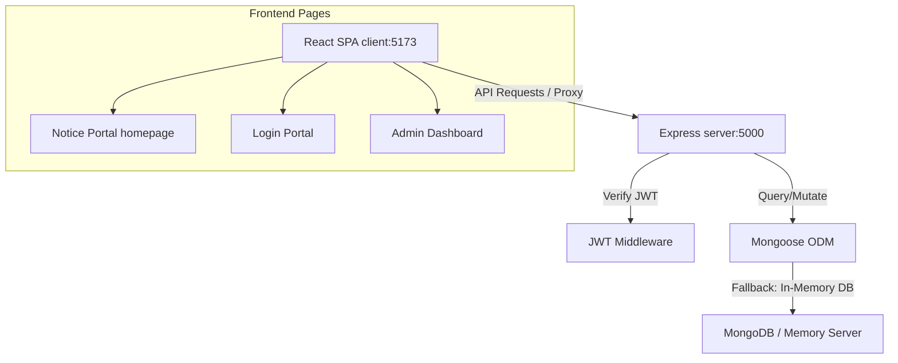

# 🎓 UniStream | Premium MERN Notice Portal

[](https://opensource.org/licenses/MIT)
[](https://nodejs.org)
[](https://vite.dev)

A visually stunning, fully functional **MERN (MongoDB, Express, React, Node.js) stack Notice Portal** designed for universities. The application features premium UI/UX aesthetics including **ambient floating 2D background blobs**, **glassmorphic panels**, **staggered list animations**, and a **dynamic alert ribbon marquee** driven by database updates.

---

## 🎨 Premium Visual Elements

1. **Ambient Motion Design**: Three colorful SVG blobs drift in the background with slow keyframe animations, creating an engaging 2D floating background.
2. **Glassmorphism Theme**: Uses semi-transparent glass cards (`backdrop-filter: blur(16px)`) with thin borders and gradient headers that look sleek in both light and dark modes.
3. **Dynamic Alert Ribbon**: A marquee alert that displays targeted urgent announcements directly synced from the database.
4. **Micro-Animations**: Clean card lifts, button scaling, and staggered page load transitions powered by **Framer Motion**.

---

## 🏗️ Architectural Workflow

The application operates as a decoupled client-server structure:



---

## 📂 Project Directory Structure

```text
├── backend/
│   ├── middleware/
│   │   └── authMiddleware.js    # JWT authorization route guard
│   ├── routes/
│   │   ├── auth.js              # Admin authentication endpoint
│   │   └── notices.js           # CRUD operations for notice listings
│   ├── models.js                # User & Notice Mongoose Schema models
│   ├── server.js                # Express app startup & seeding script
│   ├── .env                     # Environmental variables setup
│   └── package.json             # Backend dependencies list
│
├── frontend/
│   ├── public/                  # Static logos and SVG assets
│   ├── src/
│   │   ├── components/          # Header, AlertRibbon, BackgroundBlobs
│   │   ├── pages/               # NoticePortal, LoginPortal, AdminDashboard
│   │   ├── App.jsx              # Client routing configuration
│   │   ├── index.css            # Custom CSS token design system
│   │   └── main.jsx             # React DOM entry point
│   ├── vite.config.js           # Proxy router settings
│   └── package.json             # Frontend dependencies list
│
└── original/                    # Archived legacy static files
```

---

## 🚀 Getting Started

### Prerequisites
- [Node.js](https://nodejs.org/) (v22.0.0 or higher recommended)
- [npm](https://www.npmjs.com/) (installed automatically with Node)

---

### Installation & Launch

#### 1. Clone the repository
```bash
git clone https://github.com/Harrycoding1/MERN-Stack-Notice-Portal-with-Premium-Visuals.git
cd MERN-Stack-Notice-Portal-with-Premium-Visuals
```

#### 2. Start the Backend API Server
1. Navigate to the backend directory:
   ```bash
   cd backend
   ```
2. Install dependencies:
   ```bash
   npm install
   ```
3. Run the development server:
   ```bash
   npm run dev
   ```
   *Note: If no `MONGO_URI` is provided in `.env`, the server automatically starts an in-memory database via `mongodb-memory-server` and seeds default data. Port: **5000**.*

#### 3. Start the Frontend client
1. Open a new terminal and navigate to the frontend directory:
   ```bash
   cd frontend
   ```
2. Install dependencies:
   ```bash
   npm install
   ```
3. Run the Vite development server:
   ```bash
   npm run dev
   ```
   *Note: The frontend server runs on port **5173** and proxies API calls to port **5000**.*

---

## 🔑 Seeding & Credentials

For test verification, the backend automatically seeds a default administrative user on startup:

- **Campus Email**: `admin@unistream.edu`
- **Security Password**: `admin12345`

You can use these credentials on the `/login` screen to access the Admin Dashboard.

---

## 🔌 API Documentation Reference

| Endpoint | Method | Access | Description |
| :--- | :--- | :--- | :--- |
| `/api/auth/login` | `POST` | Public | Validates email/password and returns a JWT |
| `/api/notices` | `GET` | Public | Retrieves active notices. Filters: `department`, `search` |
| `/api/notices` | `POST` | Private | Creates a notice. Payload: `{title, content, category, department, expiryDays}` |
| `/api/notices/:id` | `DELETE` | Private | Removes a notice by ID |

---

## 📄 License
This project is licensed under the MIT License - see the LICENSE file for details.
